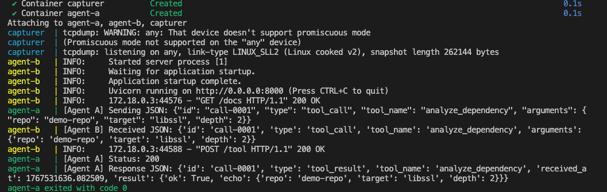
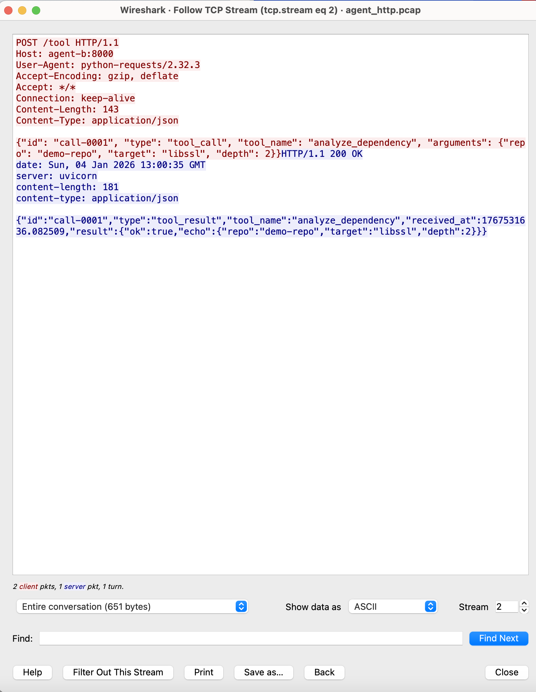

# Agent MITM

간단한 에이전트 간 HTTP 호출 및 패킷 캡처 프로젝트. Docker Compose로 두 에이전트와 패킷 캡처 컨테이너를 띄워 에이전트 A가 에이전트 B의 툴 엔드포인트를 호출하는 흐름을 재현합니다. tcpdump로 pcap 생성 후 Wireshark로 패킷 분석을 진행했습니다.

## 구성 파일
- [docker-compose.yml](docker-compose.yml) — 전체 서비스 정의 및 capturer 설정
- [agent_a/client.py](agent_a/client.py) — 에이전트 A 클라이언트 (함수: [`main`](agent_a/client.py))
- [agent_a/Dockerfile](agent_a/Dockerfile), [agent_a/requirements.txt](agent_a/requirements.txt)
- [agent_b/server.py](agent_b/server.py) — 에이전트 B 서버 FastAPI 엔드포인트 (함수: [`tool`](agent_b/server.py))
- [agent_b/Dockerfile](agent_b/Dockerfile), [agent_b/requirements.txt](agent_b/requirements.txt)
- [capturer/agent_http.pcap](capturer/agent_http.pcap) - tcpdump 실행하여 pcap 저장

## 서비스 요약
- agent-b: FastAPI 서버를 실행하고 POST /tool 요청을 받아 간단한 echo 응답을 반환합니다. 로그로 수신 JSON을 출력합니다. ([agent_b/server.py](agent_b/server.py))
- agent-a: 서버가 준비될 때까지 대기 후 `/tool`로 JSON을 POST 합니다. 기본 SERVER_URL은 `http://agent-b:8000/tool`로 설정됩니다. ([agent_a/client.py](agent_a/client.py))
- capturer: 네트워크를 캡처하기 위해 `nicolaka/netshoot` 이미지를 사용해 `tcpdump`로 포트 8000 트래픽을 `/capture/agent_http.pcap`에 저장합니다. (정상적으로 트래픽 캡처 권한 필요)

## 실행 방법
1. 빌드 및 실행:
```sh
docker-compose up --build


## 🧪 실험 결과

Agent 로그에서 JSON 송·수신 확인 (스크린샷 1)

Wireshark에서 TCP Stream 추적을 통해 POST /tool 및 JSON payload 확인 (스크린샷 2)

## ⚠️ 환경 이슈 및 해결

macOS Docker Desktop 환경에서는 컨테이너 간 트래픽이 any 인터페이스에서 캡처되지 않는 문제가 발생하였다.
이를 해결하기 위해 capturer 컨테이너가 server 컨테이너의 네트워크 네임스페이스를 공유하도록 설정하여 정상적으로 패킷을 캡처하였다.


아 👍 이해했어.
**“README에 스크린샷을 설명만 쓰는 게 아니라, 실제 PNG 파일을 ``로 첨부해서 보이게”** 하는 거지?
그럼 아래는 **네 현재 폴더 구조를 그대로 존중해서**,
👉 **README.md에 바로 복붙하면 되는 최종본**이야.

(이미지 파일은 지금 VS Code에 보이는 이름 기준으로 쓸게.
파일명이 조금 다르면 **파일명만 맞게 수정**하면 돼.)

---

# 🧪 Agent 간 HTTP 통신 및 네트워크 패킷 분석 (Docker)

## 1. 프로젝트 개요

본 프로젝트의 목표는 Docker 환경에서 **Agent 간 HTTP 통신을 구현**하고,
해당 통신이 실제 네트워크 상에서 어떻게 전송되는지를 **패킷 수준에서 확인**하는 것이다.

이를 위해 Docker Compose를 사용하여 두 개의 Agent 컨테이너를 구성하였다.

* Agent A: HTTP POST 요청을 생성하여 JSON 기반 tool-call 메시지 전송
* Agent B: FastAPI 서버로 `/tool` 엔드포인트 제공 및 JSON 응답 반환
* Capturer: `tcpdump`를 이용해 통신 패킷을 pcap 파일로 캡처

---

## 2. 시스템 구성

### 📦 컨테이너 구성

* **Agent A (Client)**

  * JSON 형태의 tool-call 메시지 생성
  * Agent B로 HTTP POST 요청 전송

* **Agent B (Server)**

  * FastAPI 기반 서버
  * `/tool` 엔드포인트에서 JSON 요청 수신
  * 처리 결과를 JSON 형태로 응답

* **Capturer**

  * `tcpdump` 실행
  * Agent 간 통신 패킷을 `pcap` 파일로 저장

---

## 3. 프로젝트 폴더 구조

```
AGENT_MITM/
├── agent_a/
│   ├── client.py
│   ├── Dockerfile
│   └── requirements.txt
├── agent_b/
│   ├── server.py
│   ├── Dockerfile
│   └── requirements.txt
├── capture/
│   └── agent_http.pcap
├── 스크린샷/
│   ├── 스크린샷 2026-01-04 오후 9.10.53.png
│   └── 스크린샷 2026-01-04 오후 10.03.40.png
├── docker-compose.yml
└── README.md
```

---

## 4. Agent 간 HTTP 통신 구현

Agent A는 다음과 같은 JSON tool-call 메시지를 생성하여
Agent B의 `/tool` 엔드포인트로 HTTP POST 요청을 전송한다.

```json
{
  "id": "call-0001",
  "type": "tool_call",
  "tool_name": "analyze_dependency",
  "arguments": {
    "repo": "demo-repo",
    "target": "libssl",
    "depth": 2
  }
}
```

Agent B는 요청을 수신한 후, 처리 결과를 JSON 형태로 반환한다.

---

## 5. 실행 방법

```bash
docker compose up --build
```

Agent 간 통신이 완료된 후, 패킷 캡처를 종료한다.

```bash
docker stop capturer
```

캡처된 패킷은 `capture/agent_http.pcap` 파일로 저장된다.

---

## 6. 실행 결과 및 증거

### 📸 6.1 Agent 로그 기반 JSON 송·수신 확인

아래 스크린샷은 Docker Compose 실행 로그로,
Agent A가 JSON tool-call 메시지를 전송하고
Agent B가 이를 수신한 뒤 처리 결과를 반환하는 과정을 보여준다.

```md

```


---

### 📸 6.2 Wireshark를 통한 네트워크 패킷 분석

`tcpdump`로 생성된 `agent_http.pcap` 파일을 Wireshark로 열고,
**Follow TCP Stream** 기능을 사용하여 Agent 간 HTTP 통신을 분석하였다.

아래 스크린샷에서 `POST /tool HTTP/1.1` 요청과 함께
JSON tool-call payload 및 서버의 JSON 응답이 평문으로 노출되는 것을 확인할 수 있다.

```md

```


---

## 7. 환경 이슈 및 해결

macOS Docker Desktop 환경에서는 컨테이너 간 네트워크 트래픽이기본 설정만으로는 캡처되지 않는 문제가 발생하였다.

이를 해결하기 위해 패킷 캡처 컨테이너가서버 컨테이너의 네트워크 네임스페이스를 공유하도록 설정하여
Agent 간 HTTP 트래픽을 정상적으로 캡처할 수 있었다.

---

## 8. 결론

본 실습을 통해 Docker 환경에서 Agent 간 HTTP 통신이실제 네트워크 상에서는 **평문 HTTP**로 전달되며,
Wireshark를 통해 JSON payload가 그대로 노출됨을 확인하였다.

